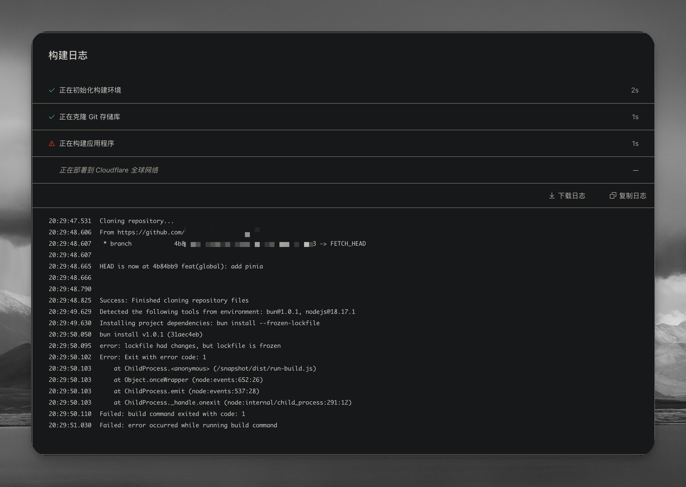
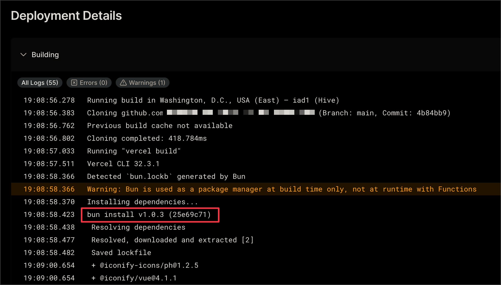
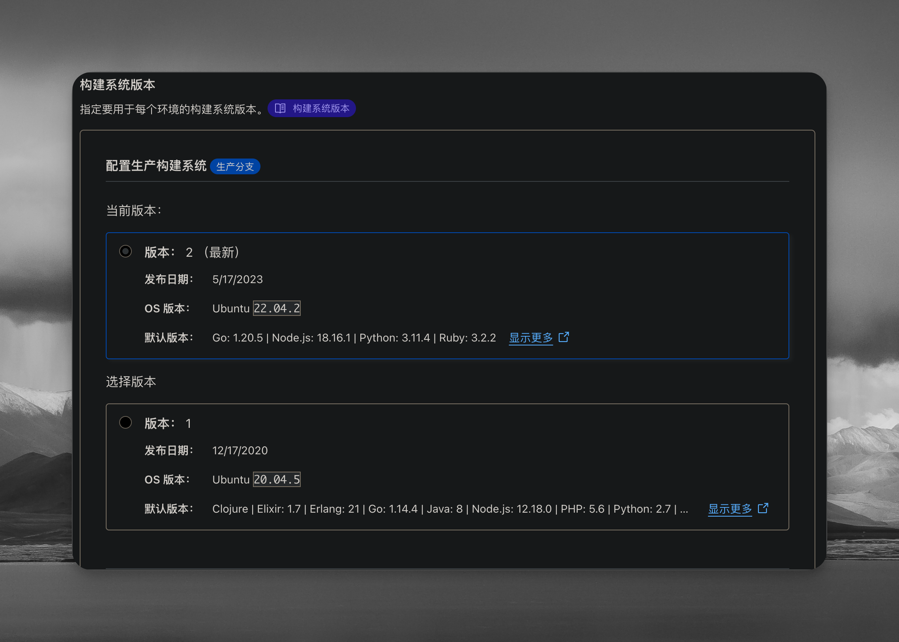
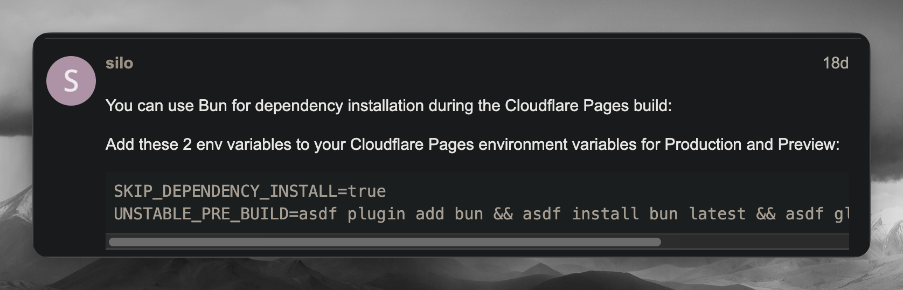
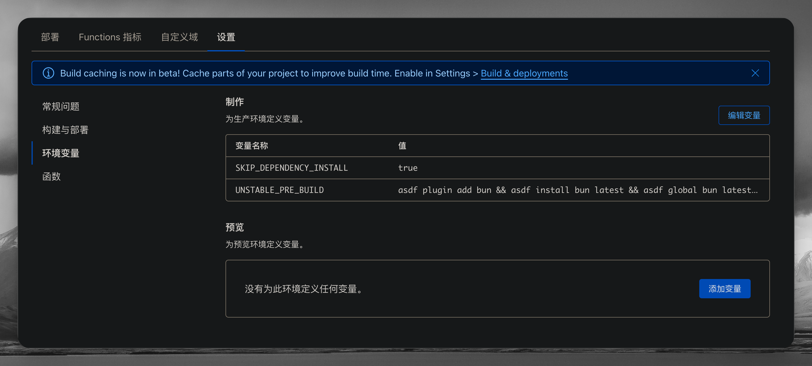
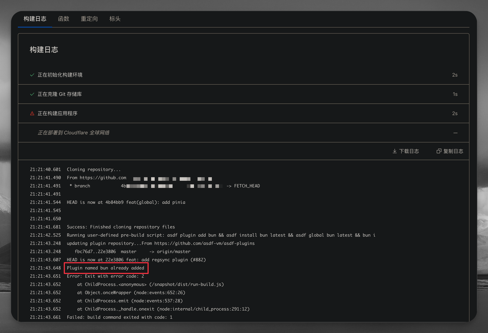
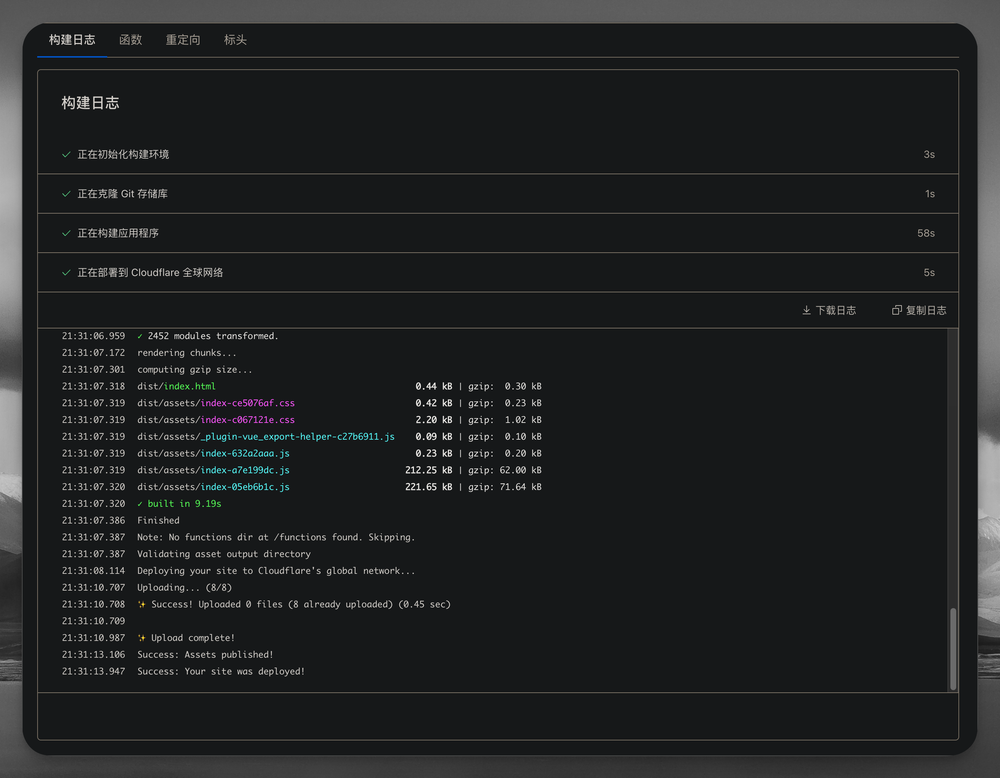

# 在 Cloudflare 部署 Bun 前端项目

本着尝鲜吃螃蟹的想法，在写一个新的前端项目时，用了最近比较火的 [bun](https://bun.sh/)。

本地开发的时候，运行起来是真的快！⚡⚡⚡

并尝试部署在 Cloudflare。

## 一切在 build 之前都很顺利……

## 还是出事儿了！



```bash
20:29:49.629	Detected the following tools from environment: bun@1.0.1, nodejs@18.17.1
20:29:49.630	Installing project dependencies: bun install --frozen-lockfile
20:29:50.050	bun install v1.0.1 (31aec4eb)
20:29:50.095	error: lockfile had changes, but lockfile is frozen
20:29:50.102	Error: Exit with error code: 1
```

我注意到这里的 bun@1.0.1 跟我本地开发使用 bun (bun@1.0.3) 不一致。

不过看了下 Cloudflare 的 pages 部署，没有显式设置 bun 版本的地方（在我看来是这样的

> 🤔，要不去隔壁 Vercel 试试？

试试就试试！

## 在 Vercel 部署

🎊，直接撒花了！


> 🤔，容俺去看个日志



> 🤔，感觉问题出在部署环境使用的 bun 的版本上

## 尝试在 Cloudflare 部署环境层面解决

> 🤔，要不在 Cloudflare 给 bun 升个级？

可是就只有类似于这样的可选项，不能细节调整。😅



总不能发邮件叫 Cloudflare 升级服务器环境版本？（虽然是可以，但感觉有点麻烦

于是上 Cloudflare 支持搜索 bun 相关的贴纸，只搜到了这个比较靠近的内容

- [No Bun Support. How?!](https://community.cloudflare.com/t/no-bun-support-how/554291)

其中有网友回复



```bash
SKIP_DEPENDENCY_INSTALL=true
UNSTABLE_PRE_BUILD=asdf plugin add bun && asdf install bun latest && asdf global bun latest && bun i
```

> 🤔，这个看起来貌似可以更新 bun 的版本？去试试！



Run：



> 🤔，看起来不能直接抄！改改！😅

## 解决

既然日志说 bun already added，那咱就不强行再 add 了。毕竟强扭的瓜不甜！

于是把 `UNSTABLE_PRE_BUILD` 的值修改为 `asdf install bun latest && asdf global bun latest && bun i`

Successful！✅



几番尝试：截至当前（2023-09-28T21:34:28+08:00），你只需要设置以下变量和值即可。

| 变量名称           | 值                                                         |
| ------------------ | ---------------------------------------------------------- |
| UNSTABLE_PRE_BUILD | asdf install bun latest && asdf global bun latest && bun i |

::: danger
以上值中的三个命令都必须要，当然顺序也不能变（相信你也能看懂大概）
:::

或者你也可以指定 bun 的版本，比如当前是最新版本 1.0.3

| 变量名称           | 值                                                        |
| ------------------ | --------------------------------------------------------- |
| UNSTABLE_PRE_BUILD | asdf install bun 1.0.3 && asdf global bun latest && bun i |

以上就是一次小的上线事故报告，以及解决方案。

Enjoy！
